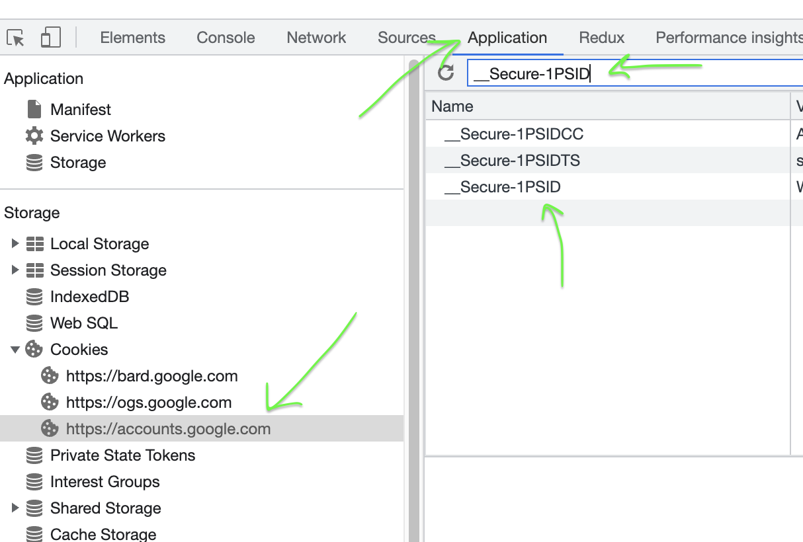
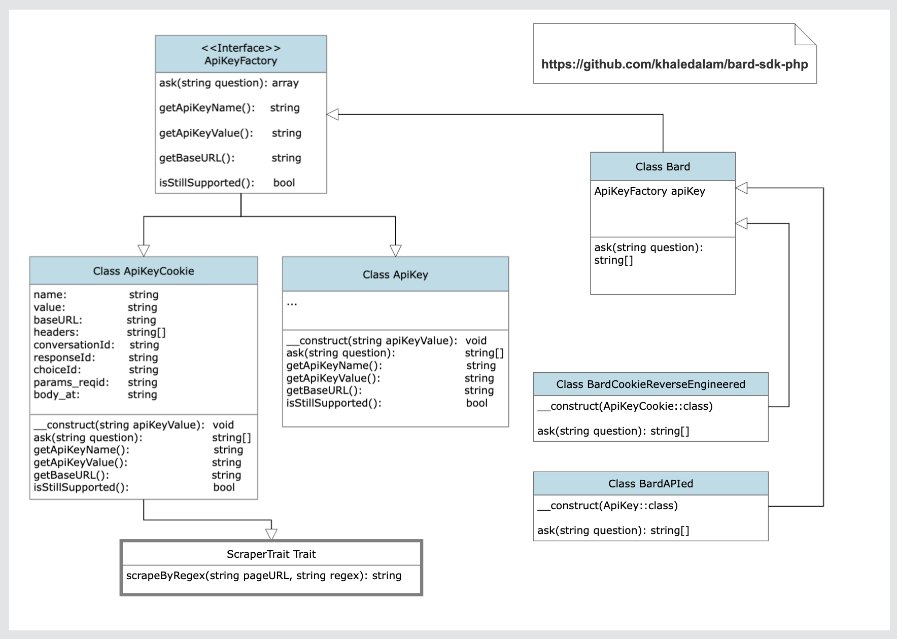

# </a> PHP SDK/API for Google Bard (experiment version) (unofficial)

Reverse engineering of Google's Bard chatbot.

## Disclamer
- ApiKeyCookie.php implemented only for easing the access to Google Bard, any legal responsibilities lie with the user.
- Don't expose your `__Secure-1PSID` cookie value on the internet.


## Install
> $ composer require khaledalam/bard-sdk-php

## Auth
1. Navigate to https://bard.google.com/
2. Open "Developer Tools" from browser settings or click [F12] shortcut for console.
3. Go to Application tab => open "Cookies" from left tab => click "https://accounts.google.com" => Copy the value of `__Secure-1PSID` cookie.<br />

## Simple Usage

Change `_YOUR_COOKIE_VALUE_`
```php
<?php

require_once('./vendor/autoload.php');

use Khaledalam\BardSdkPhp\ApiKey\ApiKeyCookie;
use Khaledalam\BardSdkPhp\Bard;

try {
    // __Secure-1PSID value
    $apiKey = '_YOUR_COOKIE_VALUE_';

    $question = "What is the recent stable version LTS of Ubuntu?";

    $bard = new Bard(new ApiKeyCookie($apiKey));

    $answer = $bard->ask($question);

    print_r($answer['content']);
    /*
    Output (May-2023):
    
    The most recent stable version of Ubuntu LTS is Ubuntu 22.04 LTS, codenamed "Jammy Jellyfish." It was released on April 21, 2022, and will be supported with free security and maintenance updates for five years, until April 2027.

    Ubuntu LTS releases are designed for use in enterprise and server environments, where reliability and stability are critical. They are also a good choice for home users who want a reliable and long-lasting operating system.
    */

} catch (Exception $e)
{
    die("Error: " . $e->getMessage());
}

```

Output (May-2023):
```
The most recent stable version of Ubuntu LTS is Ubuntu 22.04 LTS, codenamed "Jammy Jellyfish." It was released on April 21, 2022, and will be supported with free security and maintenance updates for five years, until April 2027.

Ubuntu LTS releases are designed for use in enterprise and server environments, where reliability and stability are critical. They are also a good choice for home users who want a reliable and long-lasting operating system.
```

## Examples

Example1(<a href="./examples/world_datetime_ai">world_datatime_ai</a>):
> php examples/world_datetime_ai/main.php

## Technical

### Diagram



### Methods:
- [x] Cookie
- [ ] Api key

### License
- [MIT](https://opensource.org/license/mit/)
